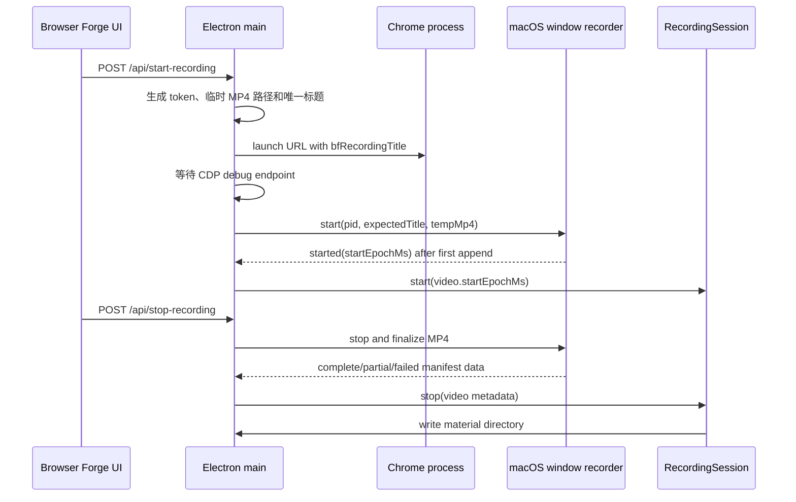

# Browser Forge 窗口级视频录制设计

## 目标与边界

本阶段为一次 Browser Forge 录制新增一段 **Chrome 原生窗口级** H.264 MP4 视频。它服务于两个场景：

1. Agent 依据 `timeline.json` 中事件的 `videoOffsetMs`，按需提取指定时刻的可视上下文。
2. 后续应用内的录制物料库以这段视频进行预览、命名、删除和导出。

本阶段只实现 **macOS 14.2 及以上**，并为 Windows 11 保留同一 JavaScript 接口和产物契约；不实现物料库 UI、录制物料迁移或内置 Agent。

当前交付矩阵：

- `darwin-arm64`：已实现窗口录制与 Agent 抽帧工具；
- `darwin-x64`：本阶段未交付，Intel Mac 会得到显式 unsupported-platform 错误；
- `win32-*`：仅保留接口、manifest 命名空间和后端设计，本阶段不包含可执行文件。

## 不可违反的录制边界

录制对象必须是 Browser Forge 本次启动的完整 Chrome 原生窗口（浏览器工具栏、标签页、地址栏和网页内容）。下列方案均不合格：

- 整个屏幕或显示器录制；
- Desktop Duplication / 显示器录制后裁剪；
- "最大的 Chrome 窗口"、"第一个 Chrome 窗口"、前台窗口；
- 用户手工任意选取的窗口；
- 仅 CDP viewport 截图。

启动时 Browser Forge 生成 128-bit session token，并将 Chrome 初始页标题设为 `Browser Forge Recording · <token>`。原生录制器仅允许匹配：

- `owningApplication.processID === chromeProcess.pid`；
- `window.title === expectedWindowTitle`；
- `window.isOnScreen === true`；
- 合格候选数 **严格等于 1**。

候选为 0 时最多等待 10 秒；候选多于 1 时立即失败；绝不降级到其他窗口或显示器。窗口在初始页阶段绑定后，即使网页导航修改 document title，流继续绑定同一个原生窗口。

## 时间轴契约

视频的零点不是点击“开始录制”的时间，也不是 CDP 连接时间，而是：

> 第一个被 `AVAssetWriterInput.append` 成功写入 MP4 的 ScreenCaptureKit video sample。

原生录制器在该 sample 到达时，以 `CMSampleBuffer` 的 PTS、host clock 与 Unix epoch 建立 `startEpochMs`。写入器从这份 sample 的 PTS 开始 session，令 MP4 内时间从 0 开始。

`RecordingSession` 的所有关键 timeline event 保留原有 `timestamp`（epoch ms），并新增：

```json
{
  "timestamp": 1786170012345,
  "videoOffsetMs": 12345
}
```

其中 `videoOffsetMs = max(0, timestamp - video.startEpochMs)`。Agent 必须优先使用该字段，禁止用 epoch 时间自行反推视频偏移。

## 录制生命周期



如果 native recorder 在首帧前失败，整个“开始录制”请求失败，不启动 CDP session，也不把录制标记为成功。停止阶段即使视频只覆盖一部分时段，CDP 物料仍可写出，但 `video/manifest.json` 必须标明 `partial` 和 `coveredUntilOffsetMs`。

## 物料协议

录制目录新增：

```text
<recording-dir>/
├── RECORDING.md
├── recording.har
├── timeline.json
├── metadata.json
├── video/
│   ├── recording.mp4
│   └── manifest.json
└── tabs/
```

`video/manifest.json` 的第一个版本：

```json
{
  "version": 1,
  "state": "complete",
  "file": "recording.mp4",
  "codec": "h264",
  "fps": 15,
  "startEpochMs": 1786170000000,
  "durationMs": 42000,
  "coveredUntilOffsetMs": 42000,
  "window": {
    "pid": 12345,
    "windowId": "platform-specific-window-id",
    "title": "Browser Forge Recording · <token>"
  }
}
```

合法 `state` 仅为 `complete`、`partial`、`failed`，并强制以下终态不变量：

- `complete`：`coveredUntilOffsetMs === durationMs`，且必须带 `recording.mp4`；
- `partial`：`0 <= coveredUntilOffsetMs <= durationMs`，且必须带可播放的已完成前缀；
- `failed`：`durationMs === 0`、`coveredUntilOffsetMs === 0`，且不得声明视频文件。

Agent 抽帧工具会再次验证这些不变量；矛盾 manifest 必须返回 `VIDEO_MANIFEST_INVALID`，不能把不完整视频误当作完整上下文。

## macOS 实现

### 分发的原生工具

应用内原生实现采用两个由 `swiftc` 构建、随 macOS App 打包的可执行文件，均只使用 macOS 自带系统框架。构建固定使用 `-target arm64-apple-macos14.2`，产物必须同时通过 arm64 Mach-O 架构与 `minos 14.2` 检查，避免在较新构建机上意外把部署目标抬高：

- `bf-window-recorder`：ScreenCaptureKit + AVFoundation；严格绑定窗口，写 H.264 MP4；行式 JSON stdout 协议。
- `bf-video-frame`：AVFoundation + ImageIO；按 MP4 时间偏移写 PNG；行式 JSON stdout 协议。

使用 Swift standalone executable 而不是 ffmpeg、Homebrew、npm、pip 或 Python。启动者在开发环境解析源码构建产物，在 packaged app 从 `process.resourcesPath/native-tools` 执行。构建失败是开发/打包阶段错误；运行时不会尝试下载或安装依赖。

ScreenCaptureKit 捕获过滤器为 `SCContentFilter(desktopIndependentWindow: targetWindow)`，并禁用音频。期望配置为 15 fps、H.264、包括鼠标光标和子窗口。程序必须向用户清楚呈现 macOS Screen Recording TCC 授权失败，不得静默产出空视频。

### JavaScript 外观层

`VideoRecorder` 负责寻找适当平台的 `bf-window-recorder`、启动子进程、解析 JSON、提供 `start()` 和 `stop()`，且可依赖注入 `spawn`/路径解析器以便单元测试。当前 native tool registry 只接受 `darwin-arm64`；`darwin-x64` 和尚未交付的 Windows target 必须在 spawn 前返回显式 `UNSUPPORTED_PLATFORM`。

stdout 是行式 JSON 协议。ChildProcess 的 `exit` 只记录退出状态，不能立即判定录制失败；必须等 `close`（stdio 已排空）并处理 stdout 最后一条可能没有换行的消息，防止合法 `completed` 被退出竞态吞掉。首帧后出现协议错误、子进程错误或非法终态时，JavaScript 层必须终止仍存活的 native child，并 fail closed 为 `failed`。

## Agent 帧提取工具

analysis skill 新增：

```bash
scripts/extract-video-frame \
  --recording-dir "/absolute/path/to/recording" \
  --offset-ms 12345 \
  --output "/tmp/browser-forge-frame-12345.png"
```

它读取 `video/manifest.json`、校验 state、视频文件、offset 范围和输出覆盖策略，然后调用 skill 自身携带的 `assets/video-tools/<platform-arch>/bf-video-frame`。成功 stdout 是单行 JSON：

```json
{"requestedOffsetMs":12345,"actualOffsetMs":12345,"output":"/tmp/frame.png","width":1440,"height":900}
```

规定错误码：`VIDEO_MANIFEST_NOT_FOUND`、`VIDEO_FILE_NOT_FOUND`、`VIDEO_STATE_FAILED`、`VIDEO_OFFSET_OUT_OF_RANGE`、`VIDEO_OFFSET_NOT_COVERED`、`OUTPUT_ALREADY_EXISTS`、`UNSUPPORTED_PLATFORM`、`EXTRACTION_FAILED`。

安装器必须随 skill 一起复制原生工具、保持可执行位，并通过 `assets/video-tools/manifest.json` 的 SHA-256 验证它们。manifest 采用 `<platform>-<arch>` namespace，安装器通用遍历所有已声明 target，不永久要求 Darwin 资源；空工具清单、缺失文件或 hash 不一致都会拒绝安装。工具不可用时，skill 安装应报告失败，而不是把错误推迟到 Agent 分析时。

Electron ASAR 虚拟文件系统不会可靠保留打包前的 POSIX executable bit。因此安装器不能依赖 `stat(source).mode`：复制到 staging 后，它必须把三个 shell wrapper 与 manifest 中声明的所有非 Windows 原生工具显式恢复为 `0755`，再进行 SHA-256 和 executable 校验。managed skill 的内容哈希包含文件权限，且“current”判断同时校验实际安装目录，避免权限被外部修改后仍错误地跳过修复。Windows 工具不依赖 POSIX executable bit，但继续使用同一 manifest 完整性校验流程。

视频物料写入与 CDP 物料写入相互隔离：临时 MP4 复制/重命名失败时，`recording.har`、`timeline.json`、`metadata.json`、tabs、DOM、console、scripts 与 `RECORDING.md` 仍必须完成落盘；`video/manifest.json` 降级为安全的 `failed`，且不得留下半写入的 `.recording.mp4.tmp` 或宣称存在 `recording.mp4`。

## Windows 11 兼容设计

Windows 后端不属于本次交付，但将实现同一个 `VideoRecorder` 和 `extract-video-frame` 命令契约。公共稳定入口是 `node scripts/extract-video-frame.mjs`，Windows 同时提供 `scripts/extract-video-frame.cmd` 适配器；当前没有 Windows 原生二进制时会明确返回 `UNSUPPORTED_PLATFORM`。捕获后端应使用：

```text
Chrome PID + title token
→ EnumWindows / GetWindowThreadProcessId / GetWindowTextW
→ unique HWND
→ IGraphicsCaptureItemInterop::CreateForWindow(HWND)
→ Windows Graphics Capture
→ Media Foundation H.264 MP4 writer
```

禁止 `CreateForMonitor`、Desktop Duplication、monitor capture、区域裁剪和 `GetForegroundWindow`。Windows 帧工具将使用 Media Foundation，并保持相同 CLI 参数与 JSON 输出。资源注册为 `win32-x64/bf-video-frame.exe`，由同一 `assets/video-tools/manifest.json` 做 SHA-256 校验；Windows launcher 可使用 `.cmd` 或直接调用 Node `.mjs` 入口，但用户与 Agent 看到的参数、错误码和单行 JSON 契约不变。
